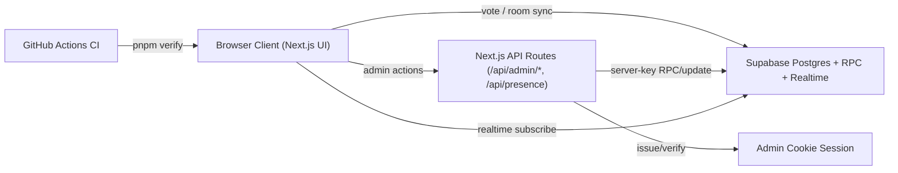

# StoryVote

StoryVote is a realtime planning poker app for scrum teams.

Version `v1.0.0` includes:
- Realtime room presence with heartbeat and inactivity handling
- Round lifecycle: `open -> revealed -> reopened -> closed`
- Inline admin controls (passcode + cookie session)
- Round history and PDF export
- ES/EN support and dark/light theme toggle
- CI quality gate (`pnpm verify`)

## Tech Stack

- Next.js 16 (App Router)
- React 19
- TypeScript
- Tailwind CSS 4
- Supabase (Postgres + Realtime)
- Playwright (smoke E2E)

## Architecture



## Main Flows

1. User enters `name + room` and joins.
2. Presence is upserted and synced in realtime.
3. Admin opens round with a story.
4. Team votes with Fibonacci cards (`1, 2, 3, 5, 8, 13, 20, ∞`).
5. Admin reveals votes, can re-open for another pass, then closes.
6. Closed rounds appear in history and can be exported to PDF.

## Project Structure

- `/Users/pablo/Projects/storyvote/app` - routes/pages/API endpoints
- `/Users/pablo/Projects/storyvote/components` - UI and feature components
- `/Users/pablo/Projects/storyvote/system` - Supabase + admin session helpers
- `/Users/pablo/Projects/storyvote/supabase/migrations` - DB migrations
- `/Users/pablo/Projects/storyvote/e2e` - Playwright smoke tests
- `/Users/pablo/Projects/storyvote/docs` - release and ops docs

## Environment Variables

Create `/Users/pablo/Projects/storyvote/.env.local`:

```env
NEXT_PUBLIC_SUPABASE_URL=
NEXT_PUBLIC_SUPABASE_ANON_KEY=
SUPABASE_SERVICE_ROLE_KEY=
ADMIN_SESSION_SECRET=
```

Notes:
- `NEXT_PUBLIC_*` values are client-visible.
- `SUPABASE_SERVICE_ROLE_KEY` is server-only and must never be exposed to client code.
- `ADMIN_SESSION_SECRET` should be a long random secret.

## Database Migration Strategy

Choose exactly one path:

1. Fresh environment (recommended):
- Apply `/Users/pablo/Projects/storyvote/supabase/migrations/000_baseline_v1.sql`

2. Existing environment upgrading from older versions:
- Apply incremental migrations in order:
  - `001_init_rooms.sql` ... `011_round_reveal_workflow.sql`

Do not apply both baseline and incrementals on the same fresh database.

## Local Setup

1. Install dependencies:

```bash
pnpm install
```

2. Configure `.env.local`.
3. Apply DB migrations using one strategy above.
4. Start dev server:

```bash
pnpm dev
```

5. Open [http://localhost:3000](http://localhost:3000).

## Scripts

- `pnpm dev` - start dev server
- `pnpm build` - production build
- `pnpm build:ci` - production build in webpack mode (CI-stable)
- `pnpm start` - start production server
- `pnpm lint` - ESLint checks
- `pnpm typecheck` - route typegen + TypeScript checks
- `pnpm test:e2e` - Playwright smoke suite
- `pnpm test:e2e:headed` - headed Playwright run
- `pnpm verify` - full gate: lint + typecheck + build + e2e

## API Endpoints

Admin/session and presence:
- `/api/admin/session`
- `/api/admin/story`
- `/api/admin/reset`
- `/api/admin/round/start`
- `/api/admin/round/reveal`
- `/api/admin/round/reopen`
- `/api/admin/round/end`
- `/api/presence`

## Presence and Session Rules

- Presence heartbeat interval: 60s
- Inactivity timeout: 5 minutes
- On page hide/leave, client sends keepalive inactive mark
- Admin auth is passcode validated server-side and persisted as signed httpOnly cookie

## Testing and CI

- CI workflow runs `pnpm verify` on push/PR
- Current smoke tests cover:
  - language toggle persistence
  - theme toggle persistence
  - custom not-found flow
  - creating a new room requires admin passcode

## Release

- Use `/Users/pablo/Projects/storyvote/docs/release-checklist.md` before tagging
- Ensure migration `011_round_reveal_workflow.sql` is applied on upgraded environments
